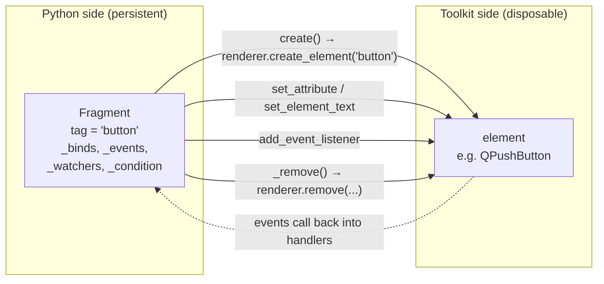
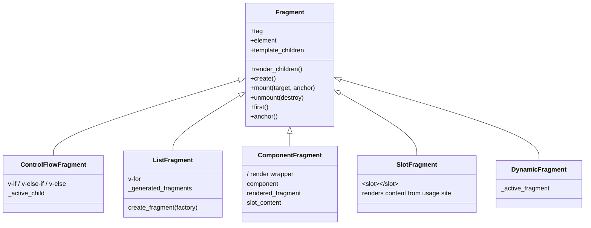
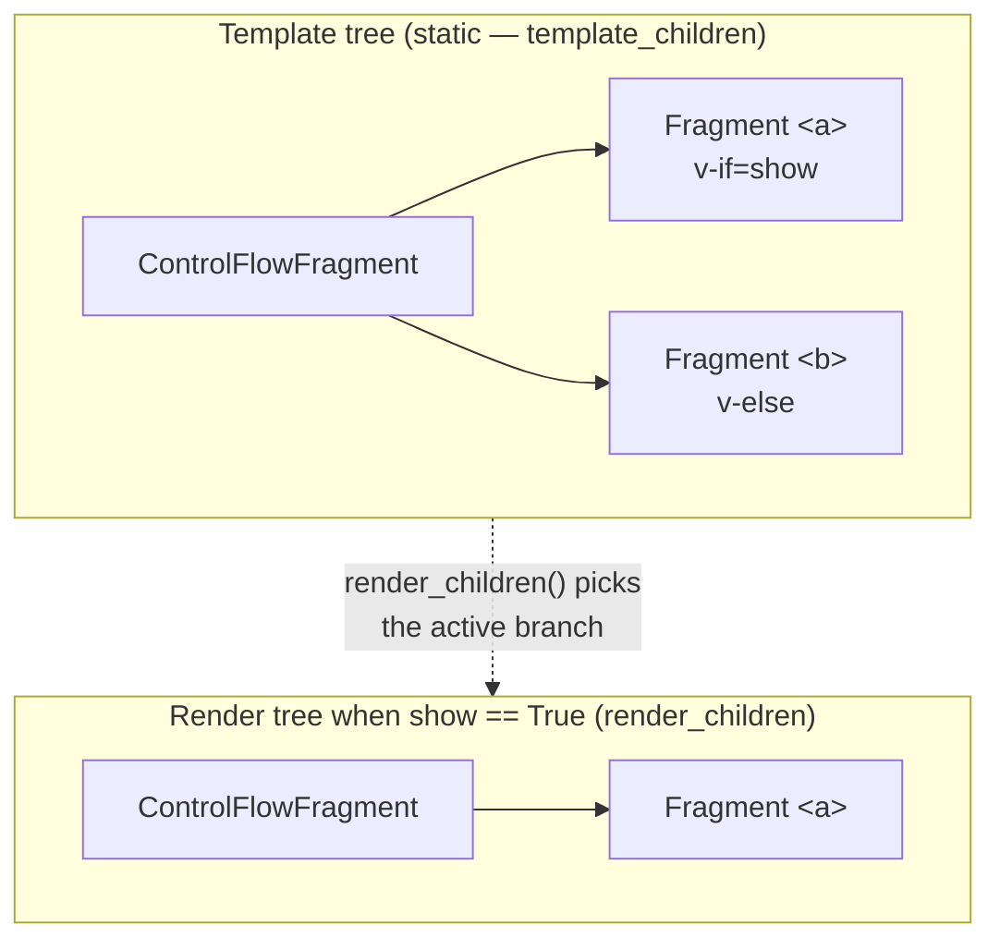
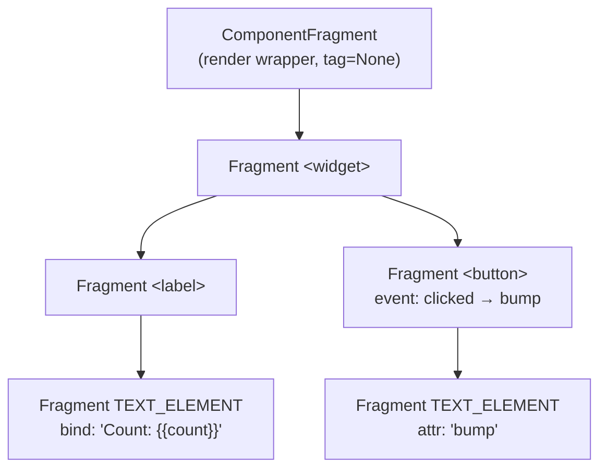
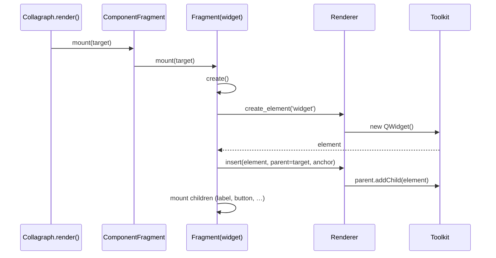
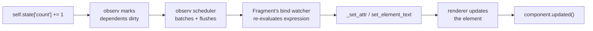
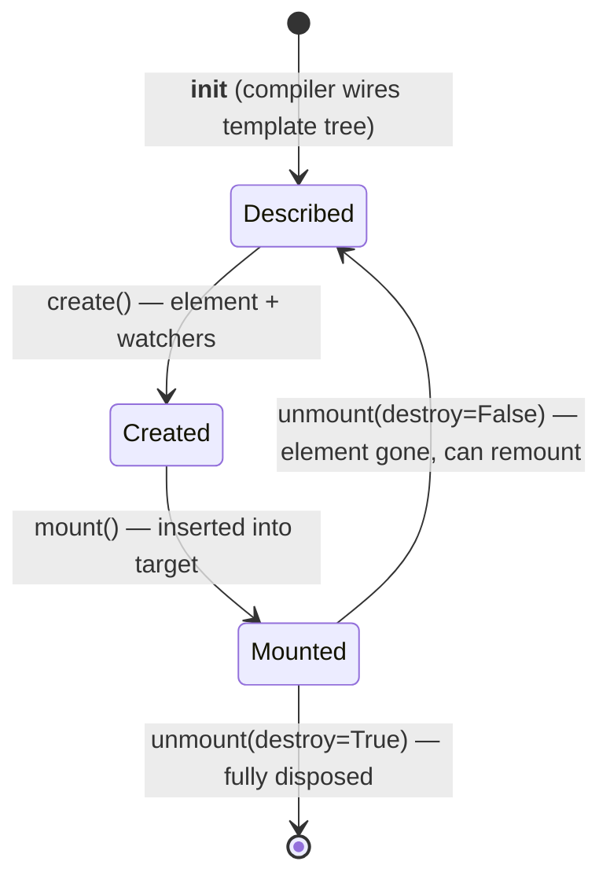
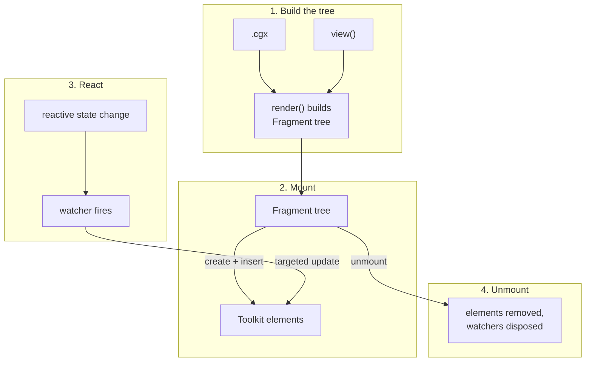

# Architecture

!!! note

    You don't need to understand any of this to *use* Collagraph. This page
    is for the curious, and for anyone who wants to hack on Collagraph itself.
    If you just want to build UIs, the [Guide](../guide/components.md) has
    everything you need.

Collagraph turns a declarative UI description into a live UI and keeps that UI
in sync with your reactive state. Under the hood there are four cooperating
pieces:

- **The compiler** ([`collagraph.sfc`](https://github.com/fork-tongue/collagraph/tree/main/collagraph/sfc)) —
  reads a `.cgx` single-file component and rewrites its `<template>` into a
  Python `render()` method that builds a tree of **Fragments**.
- **Fragments** ([`collagraph.fragment`](https://github.com/fork-tongue/collagraph/blob/main/collagraph/fragment.py)) —
  lightweight objects that *describe* a node in the UI tree. They hold the
  reactive glue (watchers, binds, conditions) and know how to create, mount,
  update and unmount the real toolkit **elements**.
- **Renderers** ([`collagraph.renderers`](https://github.com/fork-tongue/collagraph/tree/main/collagraph/renderers)) —
  translate a Fragment's intentions ("create a `button`", "set attribute
  `text`", "insert before this element") into concrete toolkit calls
  (PySide6 widgets, Pygfx objects, or plain dicts for testing).
- **[observ](https://github.com/fork-tongue/observ)** — the reactivity engine.
  Every dynamic part of the template is wrapped in an observ `watch`/`computed`
  so that a change to state re-runs *only* the affected piece of the UI.

The compiler is not the only way to build that Fragment tree. A component can
also describe its UI in **plain Python** by implementing a `view` method
instead of a `.cgx` template. The pure-Python
[view API](../guide/python-views.md) (`h`, `when`, `each`, …) builds the *same*
Fragment tree directly, with no compile step — so `.cgx` and `view`-based
components can be mixed freely. Everything below the Fragment tree — the
Fragments, renderers and observ — is shared by both front-ends. This page uses
`.cgx` examples throughout, but every mechanism it describes applies unchanged
to a `view`-based component.

At a glance, the whole system looks like this:

```mermaid
flowchart TD
    subgraph authoring [Authoring time]
        CGX[".cgx single-file component"]
        Compiler["SFC compiler<br/>(collagraph/sfc)"]
        View["view() method<br/>(pure-Python view API)"]
        Render["Component.render()<br/>builds a Fragment tree"]
        CGX -->|compiles to| Compiler
        Compiler -->|injects| Render
        View -->|build_view() runs it| Render
    end

    subgraph runtime [Runtime]
        CG["Collagraph<br/>(orchestrator)"]
        Frag["Fragment tree<br/>(describes the UI)"]
        Renderer["Renderer<br/>(PySide / Pygfx / dict)"]
        Elements["Toolkit elements<br/>(QWidget, Pygfx object, dict)"]
        Observ["observ<br/>(reactive state + scheduler)"]

        CG -->|render + mount| Render
        Render --> Frag
        Frag -->|create / insert / set_attribute| Renderer
        Renderer --> Elements
        Observ -.->|state change triggers watcher| Frag
        Frag -.->|updates| Elements
    end

    Render -.-> Frag
```

The rest of this page zooms in on the relationship that does most of the work:
**Fragments and elements.**

## Fragments vs. elements

This is the central idea, so it's worth stating plainly:

> A **Fragment** is a persistent, Python-side *description* of one node in the
> UI tree. An **element** is the actual, toolkit-side *object* that a Fragment
> creates and manages (a `QWidget`, a Pygfx object, a dict entry…).

The Fragment is the stable "controller"; the element is the disposable
"view". A Fragment lives for as long as that spot in the template is relevant.
Its element can be created, destroyed and re-created underneath it (during a
`v-if` toggle, a hot reload, or a dynamic `<component :is>` swap) without the
Fragment itself going away.



Not every Fragment owns an element. Fragments whose `tag` is `None` or
`"template"` (virtual/structural fragments) have `element = None` — they exist
purely to group children or to host reactive control-flow. `ComponentFragment`,
`ControlFlowFragment`, `ListFragment`, `SlotFragment` and `DynamicFragment` are
all "elementless" in this sense: they contribute structure, and their *children*
are what produce real elements. This is why the code frequently walks the tree
with [`first()`](#anchors-and-first) to find "the first real element in or below
this fragment".

## The Fragment family

There is a small hierarchy of Fragment subclasses. Each one overrides
`render_children()` (and often `mount`/`unmount`) to express a different piece
of template behaviour.



| Fragment | Template construct | What it manages | Owns an element? |
|----------|--------------------|-----------------|------------------|
| `Fragment` | a plain tag `<button>` / `TEXT_ELEMENT` | one element + its attrs, binds and events | **yes** |
| `ControlFlowFragment` | `v-if` / `v-else-if` / `v-else` | which branch is active | no |
| `ListFragment` | `v-for` | one generated child fragment per item | no |
| `ComponentFragment` | `<MyComponent>` and the component's render root | a `Component` instance + its rendered output + slot content | no |
| `SlotFragment` | `<slot>` | renders slot content supplied at the usage site | no |
| `DynamicFragment` | `<component :is="expr">` | swaps the active fragment when the expression changes | no |

## Two trees: template vs. render

Every Fragment participates in **two** conceptual trees, and keeping them
distinct is what makes conditional and list rendering work cleanly.

1. **Template tree** (static) — the structure written in the `.cgx` template,
   fixed at compile time. Stored in `template_children`. A `v-if` branch is
   *always* a template child of its `ControlFlowFragment`, even while hidden.

2. **Render tree** (dynamic) — what is actually mounted right now. Produced by
   `render_children()`, which each subclass overrides to filter or generate
   children based on reactive state.



For a base `Fragment`, the two trees coincide: `render_children()` just returns
`template_children`. The subclasses are where they diverge:

- `ControlFlowFragment.render_children()` yields only `_active_child`.
- `ListFragment.render_children()` yields the `_generated_fragments` it built
  from the current list, *not* the single template child that serves as its
  item factory.
- `ComponentFragment.render_children()` yields the component's
  `rendered_fragment`.

A third traversal, `iter_all_children()`, yields *everything* (template +
runtime-generated + slot content) and is used by hot reload and other code that
needs the complete tree regardless of what's currently visible.

## From template to Fragments

The compiler rewrites each component's `<template>` into a `render()` method.
The best way to see the Fragment/element mapping is to look at the generated
code. Given this counter template:

```html title="counter.cgx"
<widget>
  <label>Count: {{ count }}</label>
  <button @clicked="bump">bump</button>
</widget>
```

the compiler produces (roughly) this `render()` method:

```python
def render(self, renderer):
    component = ComponentFragment(renderer)
    widget0 = Fragment(renderer, tag='widget', parent=component)
    label0 = Fragment(renderer, tag='label', parent=widget0)
    text0 = Fragment(renderer, tag='TEXT_ELEMENT', parent=label0)
    text0.set_bind('content', lambda: f"Count: {self._lookup('count', globals())}")
    button0 = Fragment(renderer, tag='button', parent=widget0)
    button0.set_event('clicked', lambda *a, **kw: self._lookup('bump', globals())(*a, **kw))
    text1 = Fragment(renderer, tag='TEXT_ELEMENT', parent=button0)
    text1.set_attribute('content', 'bump')
    return component
```

Every tag becomes a `Fragment`; text (with `{{ }}` interpolation) becomes a
`TEXT_ELEMENT` fragment whose `content` is a *bind* (a watched expression);
`@clicked` becomes an event; static text becomes a plain attribute. Passing
`parent=` wires up the template tree as the fragments are constructed. The whole
template is wrapped in a `ComponentFragment` (the "render wrapper", with
`tag=None`) which is what `render()` returns.



### The same tree from Python

A `view` method reaches the very same Fragment tree without a compile step. The
counter above, written with the [view API](../guide/python-views.md):

```python title="counter.py"
def view(self):
    with h.widget():
        h.label(lambda: f"Count: {self.state['count']}")
        h.button("bump", on_clicked=self.bump)
```

`build_view()` — called by the default `Component.render` when a component
defines `view` instead of a template — runs this method once while an element
builder records each `h(...)` call as a `Fragment` and each keyword/positional
argument as a `set_bind`, `set_event` or `set_attribute`. The result is exactly
the `ComponentFragment` → `widget` → `label`/`button` tree shown above. Where
the `.cgx` compiler *generates* that wiring as `render()` source, the view API
*performs* the equivalent calls directly at runtime; the one rule "a plain value
is static, a callable is live" is just the runtime counterpart of the compiler's
`text="x"` vs `:text="expr"` distinction. From `mount()` onward the two are
indistinguishable.

Control flow gets its own fragment type. `v-for` compiles to a `ListFragment`
plus a **factory function** that builds one subtree per item:

```python
list0 = ListFragment(renderer, parent=widget0)

def create_widget2(context):
    widget2 = Fragment(renderer, tag='widget')
    label0 = Fragment(renderer, tag='label', parent=widget2)
    label0.set_bind('text', lambda: unpacked0()['item'])
    return widget2

list0.set_create_fragment(create_widget2, is_keyed=False, key_extractor=None)
list0.set_expression(lambda: self._lookup('items', globals()))
```

The `ListFragment` calls `create_widget2` once per list item at mount time and
whenever the list changes, producing the `_generated_fragments` that make up its
render children.

## Mounting: Fragments create elements

`mount()` is where descriptions become reality. Walking the counter tree, each
Fragment:

1. records its `target` (the parent element to render into),
2. calls `create()` — which asks the renderer for a real element and installs
   watchers for every bind, event and dynamic attribute,
3. inserts its element into the target via the renderer (using an **anchor**
   for correct positioning), and
4. recurses into its `render_children()`.



Because elementless fragments (`ComponentFragment`, `ControlFlowFragment`, …)
have no element of their own, they mount their children directly into *their*
target and pass an anchor down. This is how a `v-if` branch or a component's
output ends up in the right place in the parent element without introducing a
wrapper node.

### Anchors and `first()`

Toolkits insert children "before element X" (an *anchor*) rather than "at index
N". Two helpers make this work across the elementless fragments:

- **`first()`** returns the first real element at or below a fragment — skipping
  past elementless fragments to find something the toolkit can actually
  position against.
- **`anchor()`** returns the element that a fragment should be inserted *before*:
  the `first()` element of its next sibling in the **render tree**. If there's no
  such sibling it climbs the render parents (stopping before it would cross out
  of the mount target's subtree).

This is what lets a `ListFragment` insert new items at the correct position, and
what lets a `ControlFlowFragment` swap branches in place. Keyed `v-for`
reconciliation builds on the same primitive: it computes a
[longest-increasing-subsequence](https://github.com/fork-tongue/collagraph/blob/main/collagraph/fragment.py)
of stable items and only moves the fragments that are genuinely out of order,
using `first()`/`anchor()` to reposition their DOM.

## Reactivity: how an update flows

Every dynamic binding created during `create()` is an observ watcher. When you
mutate reactive state, observ notifies the relevant watchers, the scheduler
batches them, and each watcher callback pokes exactly the element it owns —
no diffing of a virtual tree, no re-running of `render()`.



Different template constructs install different watchers, but the shape is
always the same — a watched expression whose callback performs the smallest
possible mutation:

| Construct | Watcher installed in | Callback effect |
|-----------|----------------------|-----------------|
| `:attr` / `{{ }}` | `Fragment._watch_bind` | `renderer.set_attribute` / `set_element_text` |
| `v-bind="dict"` | `Fragment._watch_bind_dict` | add/remove per-key attribute watchers |
| `v-if` group | `ControlFlowFragment.mount` | unmount old branch, mount new one |
| `v-for` | `ListFragment.mount` | create/remove/move item fragments |
| `<component :is>` | `DynamicFragment.create` | swap the active fragment |

## Lifecycle: create, mount, unmount

A Fragment moves through a small, explicit lifecycle. The most subtle part is
`unmount(destroy=…)`:

- `unmount(destroy=True)` tears everything down: removes the element, disposes
  every watcher, and clears the fragment's state. Used when the fragment is
  genuinely gone.
- `unmount(destroy=False)` removes the element and watchers but keeps enough
  state to be re-mounted later. This is what `ControlFlowFragment` and
  `DynamicFragment` use when swapping — the *description* survives, only the
  live element is discarded.



Components hook into this lifecycle: `ComponentFragment.mount` calls the
component's `mounted()` after its subtree is in place, and
`ComponentFragment.unmount` calls `before_unmount()` first. Attribute changes on
a mounted fragment bubble a `component.updated()` up to the owning component.

The link between a fragment and *its* component is `_component_parent()` — it
walks up the parent chain to the nearest `ComponentFragment` that has a
`component`. The result is cached (parenthood is stable once mounted) and only
invalidated when a live fragment is genuinely reparented, e.g. during a
`<component :is>` tag switch.

## Renderers close the loop

Fragments never touch the toolkit directly — they go through the
[`Renderer`](../reference/renderer-api.md) interface, which is a thin,
imperative contract:

```python
class Renderer:
    def create_element(self, type): ...
    def create_text_element(self): ...
    def insert(self, el, parent, anchor=None): ...
    def remove(self, el, parent): ...
    def set_element_text(self, el, value): ...
    def set_attribute(self, el, attr, value): ...
    def remove_attribute(self, el, attr, value): ...
    def add_event_listener(self, el, event_type, value): ...
    def remove_event_listener(self, el, event_type, value): ...
```

Because the whole Fragment machinery only speaks this vocabulary, the same
component tree can drive Qt widgets (`PySideRenderer`), 3D objects
(`PygfxRenderer`) or plain dictionaries (`DictRenderer`, used in the test
suite). See the [Renderers Overview](../renderers/overview.md) for details.

## Putting it together



- The **compiler** (or a hand-written `view` method) decides *what* fragments
  exist (static structure).
- **Fragments** decide *when* elements exist and *how* they update (reactive
  structure).
- The **renderer** decides *how* elements are actually made and mutated
  (toolkit specifics).
- **observ** decides *why* an update happens and *when* it runs (reactivity +
  scheduling).

That separation is the whole architecture: a static description built once
(compiled from a `.cgx` template or assembled by a `view` method), a reactive
layer that mounts and surgically updates it, and a pluggable renderer that makes
it real on whatever toolkit you point it at.
